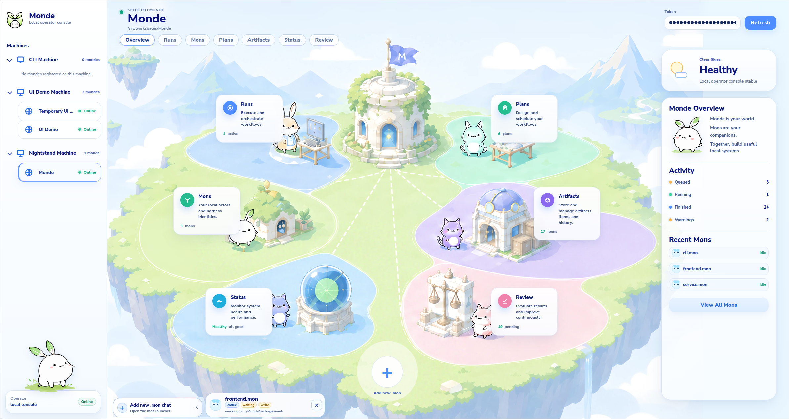
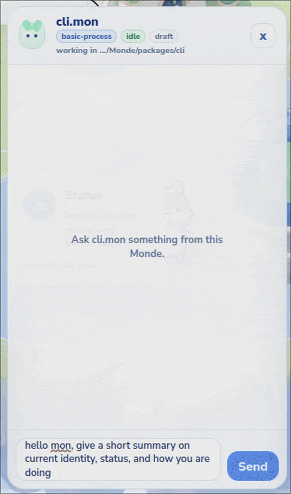
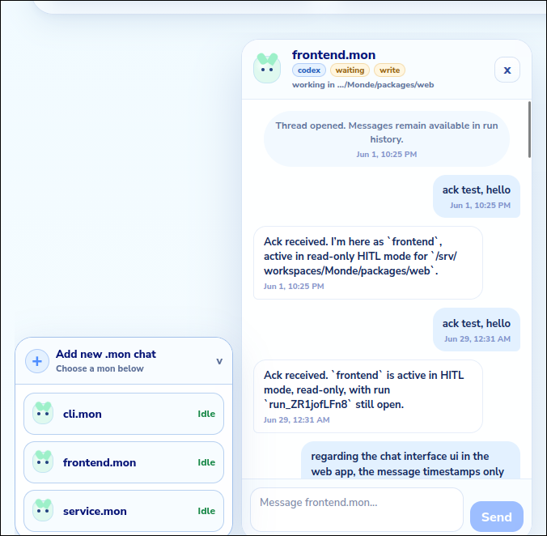
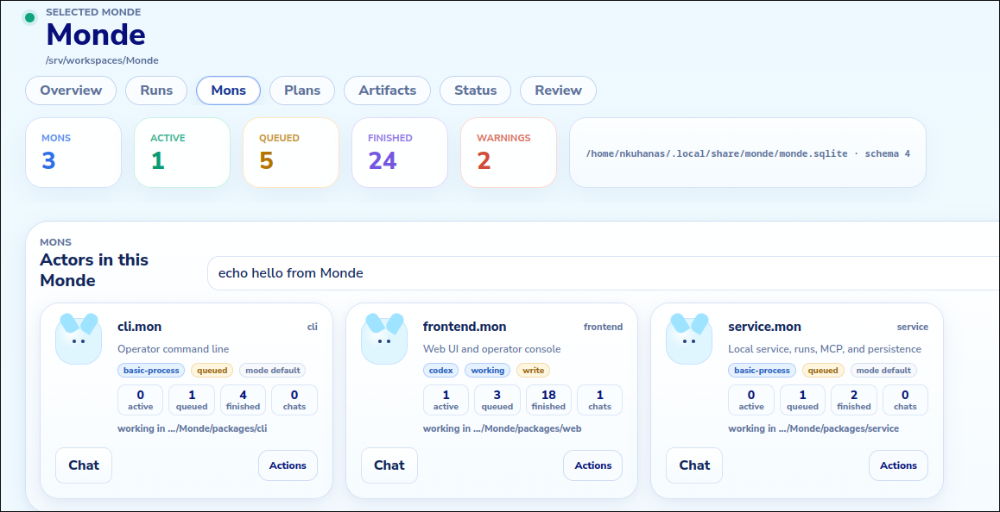
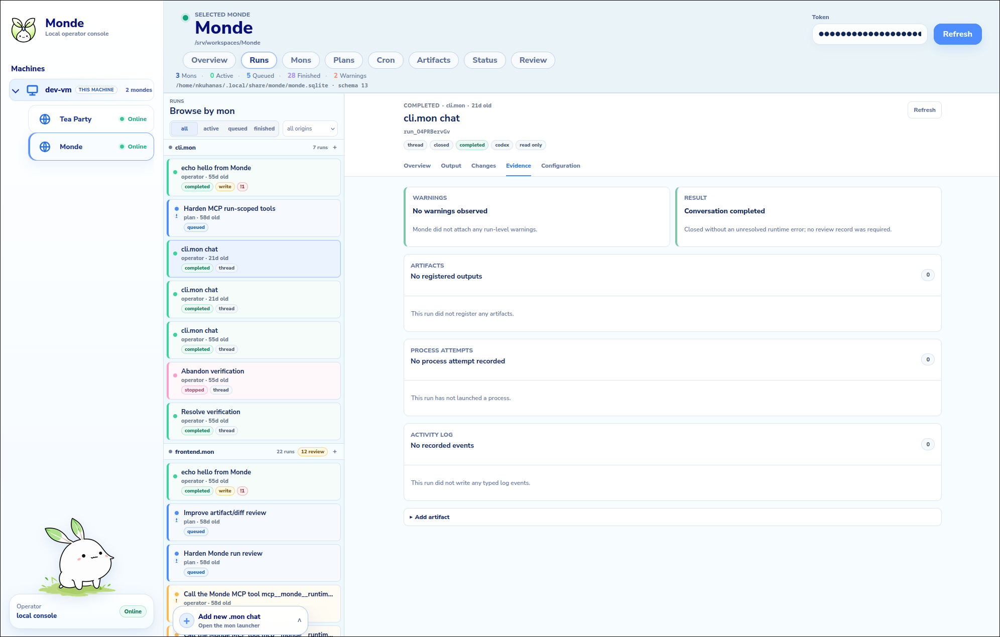

<p align="center">
  
</p>

<p align="center">
  <strong>A local operator console for AI agents working inside real project directories.</strong>
</p>

<p align="center">
  Monde makes agent work visible, scoped, reviewable, and recoverable through a local web console, CLI, MCP service, and run evidence model.
</p>

<p align="center">
  
  
  
  
</p>

<p align="center">
  <a href="#why-monde-exists">Why Monde exists</a>
  ·
  <a href="#what-monde-is">What Monde is</a>
  ·
  <a href="#see-it">See it</a>
  ·
  <a href="#quick-start">Quick start</a>
  ·
  <a href="#technical-model">Technical model</a>
  ·
  <a href="#docs">Docs</a>
</p>

---

<p align="center">
  
</p>

<p align="center">
  <em>The local command center where agents, runs, plans, artifacts, and review all stay visible.</em>
</p>

## Why Monde exists

AI agents can edit real projects, run commands, produce artifacts, and hold long
context threads. But when that work is scattered across terminal scrollback,
chat history, local files, and ad hoc prompts, it becomes hard to answer the
operator questions that matter:

- What is running right now?
- Which mon is responsible for this work?
- What scope and write permissions did it have?
- What did it output, change, or register as evidence?
- Which runs still need human review?
- Can I keep chatting with the mon without losing the operational record?

Monde exists to make local agent work visible and reviewable. It gives agents
bounded runtime scope, gives humans an operator console, and turns process
output, logs, artifacts, plans, and chat turns into durable local state.

## What Monde is

Monde is a local-first runtime and operator console for scoped AI agents inside
project directories.

```text
Human operator
  |
  v
Monde web console / CLI
  |
  v
Local service: runs, MCP, SQLite, artifacts, logs
  |
  v
Mons + harnesses: basic-process, Codex, opencode
  |
  v
Project work roots
```

The runtime centers on runs:

```text
Plan / Cron / External / Operator / System
        -> Run
        -> Logs + Artifacts + Result + Review
```

Filesystem identity is portable through `.monde/` and `*.mon` directories.
Operational state is local and service-owned in SQLite.

## See it

The UI is the main product surface. The dashboard above is the first signal:
current status, navigation sectors, machine/Monde context, high-level activity,
and chat access in one local console.

### Mon threads and chat rail

<table>
  <tr>
    <td align="center" width="44%">
      
    </td>
    <td align="center" width="56%">
      
    </td>
  </tr>
</table>

Human-in-the-loop mon threads keep chat grounded in run records. Draft chats
become server-backed `hitl_thread` runs on first send. Failures, typing states,
timestamps, harness chips, and write/read mode stay visible while the operator
keeps working elsewhere in the console.

### Mons and permissions

<p align="center">
  
</p>

Mons are local actor identities. The Mons tab keeps harness defaults,
permissions, work roots, queues, chat entry points, and management actions in
one place.

### Runs and review

<p align="center">
  
</p>

The Runs and Review surfaces expose process state, terminal output, logs,
artifacts, scope, warnings, write evidence, and explicit operator review.

## Quick start

```bash
npm install
npm run check
npm run dev:service
npm run dev:web
```

Open the web UI:

```text
http://127.0.0.1:5175
```

The UI needs the local service token. With the service running:

```bash
npm run monde -- service paths
```

Read the token from the reported token path and paste it into the UI.

## Core surfaces

| Surface | Purpose |
|---|---|
| Overview | Visual home for the selected Monde, status, sectors, and activity |
| Mons | Local agent identities, harness defaults, permissions, work roots, and chat entry points |
| Chat rail | Human-in-the-loop mon conversations backed by run records |
| Runs | Process lifecycle, terminal output, queue state, and review entry points |
| Review | Logs, artifacts, runtime scope, write evidence, result notes, and semantic outcome |
| Plans | Coordination contracts that generate queued runs from assignments |
| Cron | Generic timezone-aware schedules that enqueue ordinary Mon runs |
| Artifacts | Path-referenced evidence with bounded previews and path status |
| Status | Service health, adapter detection, backup state, doctor findings, and DB metadata |

## Technical model

Monde is a TypeScript monorepo on Node.js:

```text
packages/core      Shared schemas, DTOs, IDs, paths, and run state helpers
packages/service   Local HTTP/MCP service, SQLite persistence, run manager
packages/cli       `monde` command-line interface
packages/web       React/Vite operator console
packages/adapters  Harness adapter definitions
```

Current stack:

```text
Runtime/service:   TypeScript + Node.js
HTTP/API:          Fastify
MCP:               loopback HTTP JSON-RPC plus `monde mcp bridge`
Database:          Node built-in `node:sqlite` with local migrations
Frontend:          React + Vite + xterm.js
CLI:               TypeScript + commander
Auth:              local service token plus run-scoped MCP tokens
```

One-shot runs are process-bounded work. HITL threads are user-session-bounded
conversations. Both share the same run evidence model, but expose different
state to the operator.

Each Mon defaults to one process slot and a shared work root. Opt-in concurrent
Mons use atomic process slots and isolated run scopes with unique scratch
workspaces, immutable actor context, and explicit read mounts.

Codex write-capable runs are explicit. Codex defaults to read-only unless a
write sandbox is requested, and write runs capture metadata and diff evidence
when Git context is available. Isolated Codex support requires a locally
verified adapter capability. `basic-process` has a different trust boundary:
it is unsandboxed and runs with the Monde service user's operating-system
permissions.

Generic integration runs add durable idempotency keys, opaque bounded context,
process-exit outcomes, cancellation reconciliation, and external MCP grants
without moving workflow, retry, semantic validation, or artifact bytes into
Monde. Optional receipt-gated completion and immutable output manifests remain
available for other integrations but are not TeaParty v1 dependencies.

## Runtime support today

| Harness | Status | Use when |
|---|---|---|
| `basic-process` | Unsandboxed local fallback | You want trusted shell/process runs, smoke tests, and stdin-capable local work |
| Codex | Supported through `codex exec` | You want scoped read/write agent work with run evidence |
| opencode | Detection and conservative integration path | You are evaluating adapter breadth or future harness support |

Monde keeps harness credentials run-scoped. Harnesses receive `MONDE_RUN_ID`
and `MONDE_RUN_TOKEN`; they do not intentionally receive the root local service
token. Run tokens expire when a one-shot process finishes or a HITL adapter
turn ends or times out.

## Docs

Detailed docs live in `.monde/docs/`:

- `.monde/docs/development.md` - local setup, CLI flow, ports, smoke suites
- `.monde/docs/runtime.md` - package layout, stack, service, auth, SQLite
- `.monde/docs/run-model.md` - runs, HITL threads, queue semantics, evidence
- `.monde/docs/operator-console.md` - web UI layout and product rules
- `.monde/docs/harnesses.md` - basic-process, Codex, opencode, adapter metadata
- `.monde/docs/mcp.md` - run-scoped MCP tools and auth model
- `.monde/docs/write-runs.md` - write-capable runs and evidence capture
- `.monde/docs/plans.md` - coordination contracts and assignments
- `.monde/docs/review-flow.md` - review and semantic outcome handling
- `.monde/docs/api-contracts.md` - frontend/backend DTO and endpoint contracts
- `.monde/docs/harness-liveness.md` - HITL idle and hard timeout model
- `.monde/docs/security-model.md` - local trust boundary, scope, environment, auth
- `.monde/docs/tea-party-integration.md` - generic external execution API and examples
- `.monde/docs/tea-party-acceptance.md` - implementation-to-test acceptance map
- `.monde/docs/compatibility.md` - defaults and schema migration behavior
- `.monde/docs/backup-restore.md` - checksum verification and isolated rehearsal

Harnesses can search these docs through Monde's `search_docs` tool.

## Status

Monde is MVP local operator runtime software. The current focus is:

- making local agent work visually legible
- hardening HITL chat and run review flows
- improving write evidence and artifact review
- hardening the generic external-execution substrate
- expanding harness support without weakening scoped permissions
- keeping setup and recovery clear for local-first use

Future work includes richer onboarding visuals, packaged releases, deeper
adapter coverage, live import/restore workflows, and deployment guidance.
